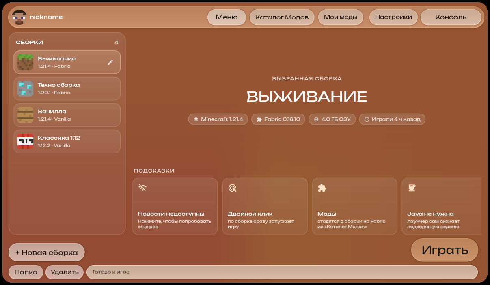

# XUI Launcher (Flutter)

Лаунчер Minecraft: Java Edition на Flutter/Dart для Windows, Linux и macOS.



## Что умеет

- **Сборки**: у каждой своя папка игры (миры, моды, настройки), версия Minecraft и загрузчик (Vanilla или Fabric).
- **Запуск в офлайн-режиме** по нику: UUID считается так же, как на офлайн-сервере.
- **Скачивание всего нужного**: клиент, библиотеки, нативные библиотеки, ресурсы и подходящая Java от Mojang (можно указать свою в настройках). Файлы проверяются по SHA-1 и общие для всех сборок; уже установленные версии запускаются без интернета.
- **Каталог модов** (Modrinth) и **Мои моды**: установка в выбранную Fabric-сборку, включение/выключение и удаление.
- **Консоль** с логом игры, **Настройки** (ник, память, Java, аргументы JVM, размер окна).
- Новости Minecraft на главной; без интернета вместо них показываются подсказки.

## Сборка

```sh
cd xui_flutter
flutter pub get
flutter run -d linux      # или windows / macos
flutter build linux --release
```

На Linux нужны `clang`, `cmake`, `ninja-build`, `pkg-config` и `libgtk-3-dev`.

Данные лаунчера лежат в папке поддержки приложения (`~/.local/share/com.xuilauncher.xui_launcher/minecraft` на Linux, `%APPDATA%\com.xuilauncher\xui_launcher\minecraft` на Windows); открыть её можно из настроек.

## Устройство

- `lib/core/` — логика: версии и правила Mojang (`game.dart`), загрузчик с проверкой хешей (`downloader.dart`), API Mojang/Fabric/Modrinth (`api.dart`), состояние (`launcher_controller.dart`).
- `lib/ui/` — интерфейс. Всё размечено в единицах исходного макета 854×493 и масштабируется вместе с окном (`Scale` в `theme.dart`), поэтому пропорции совпадают с макетом при любом размере окна.

Шрифты: [Unbounded](https://github.com/googlefonts/unbounded) и [JetBrains Mono](https://github.com/JetBrains/JetBrainsMono), обе под SIL Open Font License (`assets/fonts/OFL-*.txt`).
